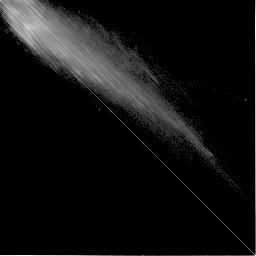
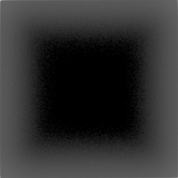
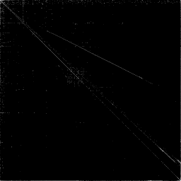
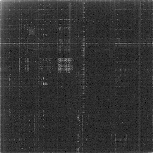

# vizlif

vizlif is a file vizualizer that can be used to create visuals such as :

`images`


`music`


`programs`



those visuals are views of the bytes paires frequency in the files as 2D coordinates

for example : AA BB CC DD EE
analyze : (AA; BB) (BB; CC) (CC; DD) (DD; EE)

# how to use

to build vizlif (and img2raw) run the following command : 
```bash
gcc -o build build.c
./build
```

then you can use the vizlif program to create your file visuals

```bash
./vizlif <file>
```

# Precisions

to get correct visuals you need to have uncompressed file (.wav, .raw, ...)

a tool named img2raw is added to this repository and built with vizlif to decompress images

you can use it like this
```bash
./img2raw <image>
```

no tools are currectly in the repo to decompress other kind of files
